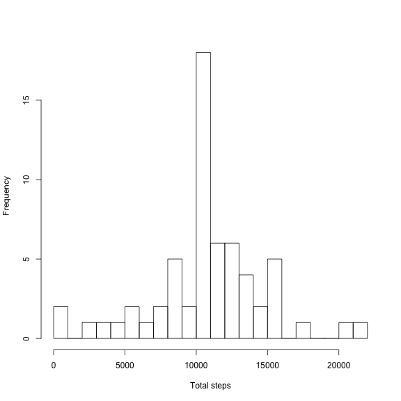
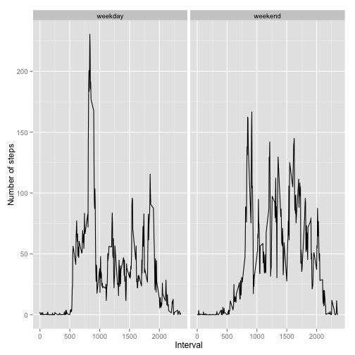
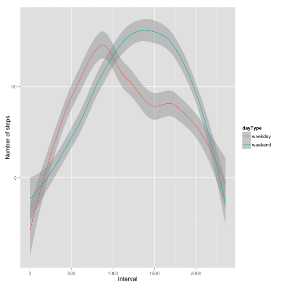

# Reproducible Research: Peer Assessment 1


## Loading and preprocessing the data  
The first step is to read the data. The first several rows of the resulting data frame are printed, so the reader can see the form of the data.

```r
pa1data <- read.csv("activity.csv")
head(pa1data, 5)
```

```
##   steps       date interval
## 1    NA 2012-10-01        0
## 2    NA 2012-10-01        5
## 3    NA 2012-10-01       10
## 4    NA 2012-10-01       15
## 5    NA 2012-10-01       20
```


## What is mean total number of steps taken per day?
To summarise the data and get an idea of the result to be expected, we make a histogram of the total number of steps taken in a day (excluding missing values).

```r
totalsteps <- aggregate(pa1data$steps, by = list(pa1data$date), sum, na.rm = TRUE)
names(totalsteps) <- c("date", "totalSteps")
hist(totalsteps$totalSteps, xlab = "Total steps", main = "", breaks = seq(0, 
    floor(max(totalsteps$totalSteps)/1000 + 1) * 1000, 1000))
```

 

Now, calculate the mean and median total number of steps taken per day using the aggregated data produced for the histogram.

```r
mean(totalsteps$totalSteps, na.rm = TRUE)
```

```
## [1] 9354
```


```r
median(totalsteps$totalSteps, na.rm = TRUE)
```

```
## [1] 10395
```


## What is the average daily activity pattern?
First, make a time series plot of the mean number of steps taken by interval (averaged over all days for that interval, with missing values removed).

```r
meanstepsbyinterval <- aggregate(pa1data$steps, by = list(pa1data$interval), 
    mean, na.rm = TRUE)
names(meanstepsbyinterval) <- c("interval", "meanStepsByInterval")
plot(meanstepsbyinterval$interval, meanstepsbyinterval$meanStepsByInterval, 
    type = "l", xlab = "Interval", ylab = "Mean steps taken", main = "Daily Activity Pattern")
```

 

It looks like on average the most activity is in one of the intervals between 5:00AM and 10:00AM. Let's find out exactly which.

```r
meanstepsbyinterval[meanstepsbyinterval$meanStepsByInterval == max(meanstepsbyinterval$meanStepsByInterval), 
    ]
```

```
##     interval meanStepsByInterval
## 104      835               206.2
```

So, the most activity is in the interval from 8:35AM-8:40AM, when the person takes on average 206.2 steps.
## Imputing missing values
Let's figure out the total number of intervals for which the number of steps is missing (i.e. the number of rows with NAs).

```r
nrow(pa1data[!complete.cases(pa1data), ])
```

```
## [1] 2304
```

That's a lot of missing data! Let's create a new dataset that replaces all of the NAs with the corresponding mean value for the interval in question, averaged over all days.


```r
completedata <- pa1data
completedata[is.na(completedata$steps), "steps"] <- meanstepsbyinterval[match(completedata[is.na(completedata$steps), 
    "interval"], meanstepsbyinterval$interval), "meanStepsByInterval"]
```

Okay, now just like we did with the original data, we plot a histogram of the total number of steps taken in a day, and calculate the mean and median as well.

```r
completetotalsteps <- aggregate(completedata$steps, by = list(completedata$date), 
    sum)
names(completetotalsteps) <- c("date", "totalSteps")
hist(completetotalsteps$totalSteps, xlab = "Total steps", main = "", breaks = seq(0, 
    floor(max(completetotalsteps$totalSteps)/1000 + 1) * 1000, 1000))
```

 

```r
m <- mean(completetotalsteps$totalSteps)
m
```

```
## [1] 10766
```

```r
median(completetotalsteps$totalSteps)
```

```
## [1] 10766
```

So now, both the mean and median have increased from their previous values. As for the histogram, the frequency of the 0-1000 bin has noticeably decreased, and the frequency of the 10000-11000 bin has noticeably increased. The main reason for this is my choice to replace the NAs in the original data with the means for the same interval averaged over all days where a count was reported. A consequence of this is that for days where previously all of the step counts were NAs, the new step counts are equal to the sum of the interval means over all intervals, which is the same as the overall mean (10766 when rounded to the nearest integer). The table below indicates the prevalence of the step count 10766 in the rounded data.

```r
sort(table(round(completetotalsteps$totalSteps)), decreasing = TRUE)
```

```
## 
## 10766    41   126  2492  3219  4472  5018  5441  6778  7047  7336  8334 
##     8     1     1     1     1     1     1     1     1     1     1     1 
##  8355  8821  8841  8918  9819  9900 10056 10119 10139 10183 10304 10395 
##     1     1     1     1     1     1     1     1     1     1     1     1 
## 10439 10571 10600 10765 11015 11162 11352 11458 11829 11834 12116 12426 
##     1     1     1     1     1     1     1     1     1     1     1     1 
## 12608 12787 12811 12883 13294 13452 13460 13646 14339 14478 15084 15098 
##     1     1     1     1     1     1     1     1     1     1     1     1 
## 15110 15414 15420 17382 20427 21194 
##     1     1     1     1     1     1
```

## Are there differences in activity patterns between weekdays and weekends?
To determine if there are differences in activity patterns between weekdays and weekends, we first add a new factor variable to the data indicating whether the date for each observation is a weekday or weekend.

```r
completedata$dayType <- as.factor(weekdays(as.Date(completedata$date)) %in% 
    c("Saturday", "Sunday"))
levels(completedata$dayType) <- c("weekday", "weekend")
summary(completedata$dayType)
```

```
## weekday weekend 
##   12960    4608
```

Let's make a panel plot of the time series of mean number of steps by interval, separating weekday from weekend data.

```r
library(ggplot2)
head(completedata, 10)
```

```
##      steps       date interval dayType
## 1  1.71698 2012-10-01        0 weekday
## 2  0.33962 2012-10-01        5 weekday
## 3  0.13208 2012-10-01       10 weekday
## 4  0.15094 2012-10-01       15 weekday
## 5  0.07547 2012-10-01       20 weekday
## 6  2.09434 2012-10-01       25 weekday
## 7  0.52830 2012-10-01       30 weekday
## 8  0.86792 2012-10-01       35 weekday
## 9  0.00000 2012-10-01       40 weekday
## 10 1.47170 2012-10-01       45 weekday
```

```r
meanStepsByWeekdayVsWeekend <- aggregate(completedata$steps, by = list(completedata$interval, 
    completedata$dayType), mean)
names(meanStepsByWeekdayVsWeekend) <- c("interval", "dayType", "meanSteps")
qplot(interval, meanSteps, data = meanStepsByWeekdayVsWeekend, facets = . ~ 
    dayType, geom = "line", xlab = "Interval", ylab = "Number of steps")
```

 

From the time series plots above, it appears that on weekdays, there is a spike in the number of steps just before and around 9:00AM, which may perhaps be when the anonymous subject goes to work (maybe he/she goes for a run before work on weekdays). Similarly, there is a relatively suppressed number of steps during the actual workday, assuming it goes from about 9:00AM to about 5:00PM. The profile of the number of steps by interval on weekends appears flatter. I will plot smoothed versions of these time series plots below to make these observations a bit more obvious.

```r
qplot(interval, meanSteps, data = meanStepsByWeekdayVsWeekend, geom = "smooth", 
    color = dayType, method = "loess", xlab = "Interval", ylab = "Number of steps")
```

 

