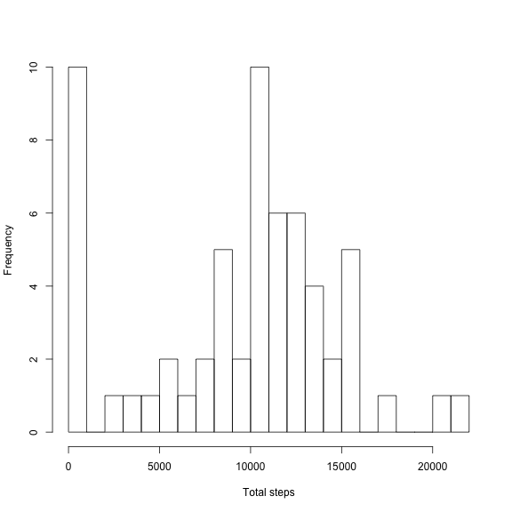
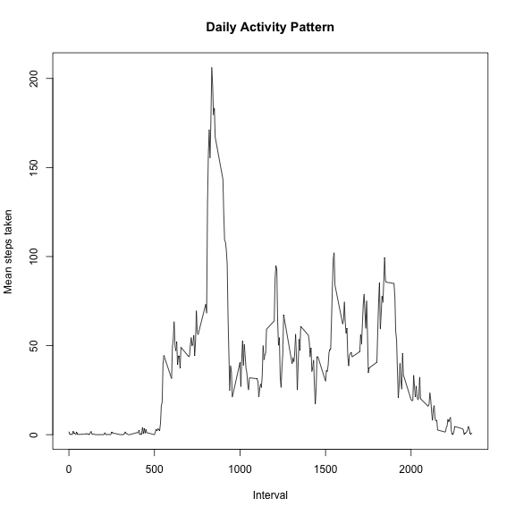

# Reproducible Research: Peer Assessment 1


## Loading and preprocessing the data  
The first step is to read the data. The first several rows of the resulting data frame are printed, so the reader can see the form of the data.

```r
pa1data <- read.csv("activity.csv")
head(pa1data, 5)
```

```
##   steps       date interval
## 1    NA 2012-10-01        0
## 2    NA 2012-10-01        5
## 3    NA 2012-10-01       10
## 4    NA 2012-10-01       15
## 5    NA 2012-10-01       20
```


## What is mean total number of steps taken per day?
To summarise the data and get an idea of the result to be expected, we make a histogram of the total number of steps taken in a day (excluding missing values).

```r
totalsteps <- aggregate(pa1data$steps, by = list(pa1data$date), sum, na.rm = TRUE)
names(totalsteps) <- c("date", "totalSteps")
hist(totalsteps$totalSteps, xlab = "Total steps", main = "", breaks = seq(0, 
    floor(max(totalsteps$totalSteps)/1000 + 1) * 1000, 1000))
```

 

Now, calculate the mean and median total number of steps taken per day using the aggregated data produced for the histogram.

```r
mean(totalsteps$totalSteps, na.rm = TRUE)
```

```
## [1] 9354
```


```r
median(totalsteps$totalSteps, na.rm = TRUE)
```

```
## [1] 10395
```


## What is the average daily activity pattern?
First, make a time series plot of the mean number of steps taken by interval (averaged over all days for that interval, with missing values removed).

```r
meanstepsbyinterval <- aggregate(pa1data$steps, by = list(pa1data$interval), 
    mean, na.rm = TRUE)
names(meanstepsbyinterval) <- c("interval", "meanStepsByInterval")
plot(meanstepsbyinterval$interval, meanstepsbyinterval$meanStepsByInterval, 
    type = "l", xlab = "Interval", ylab = "Mean steps taken", main = "Daily Activity Pattern")
```

 

It looks like on average the most activity is in one of the intervals between 5:00AM and 10:00AM. Let's find out exactly which.

```r
meanstepsbyinterval[meanstepsbyinterval$meanStepsByInterval == max(meanstepsbyinterval$meanStepsByInterval), 
    ]
```

```
##     interval meanStepsByInterval
## 104      835               206.2
```

So, the most activity is in the interval from 8:35AM-8:40AM, when the person takes on average 206.2 steps.
## Imputing missing values


## Are there differences in activity patterns between weekdays and weekends?
